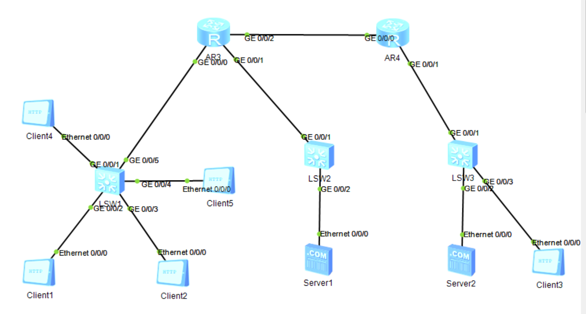
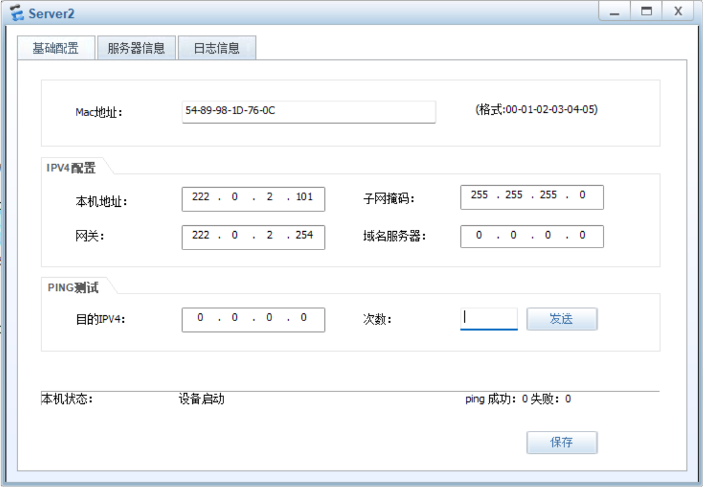
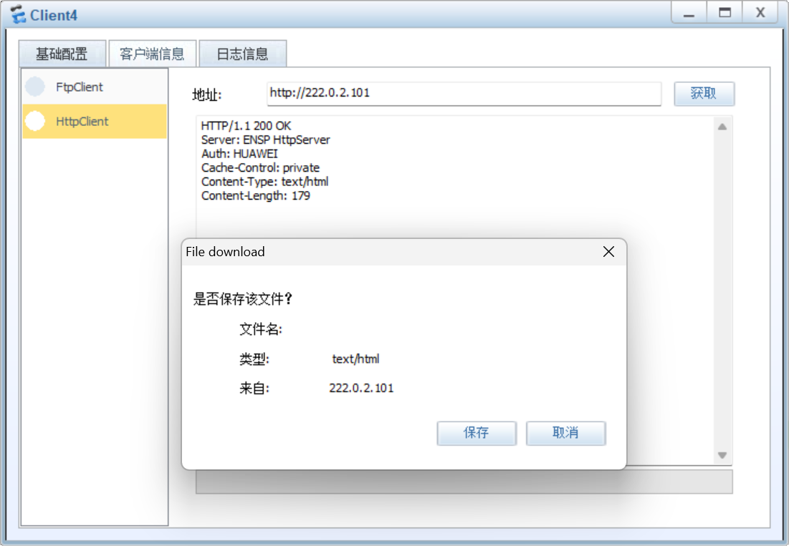
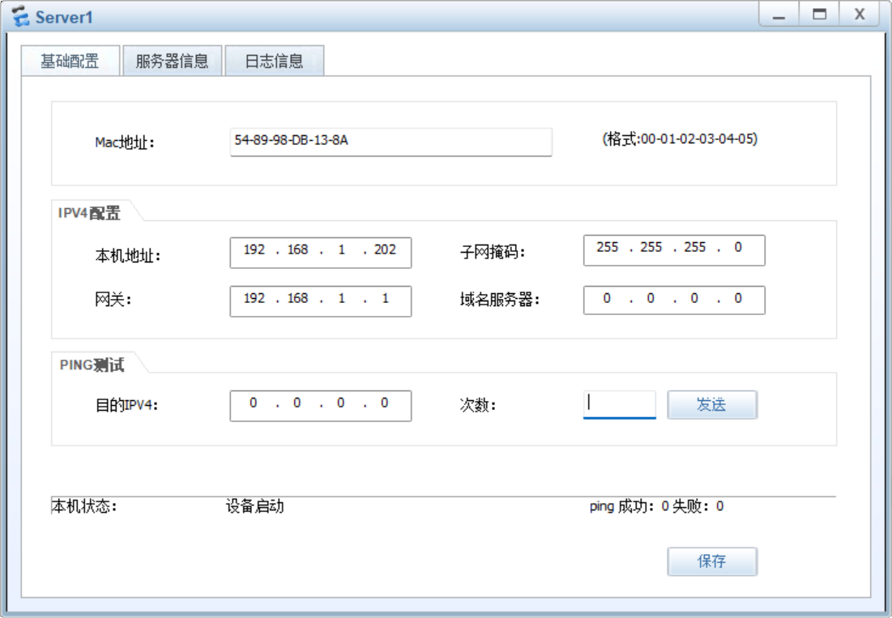
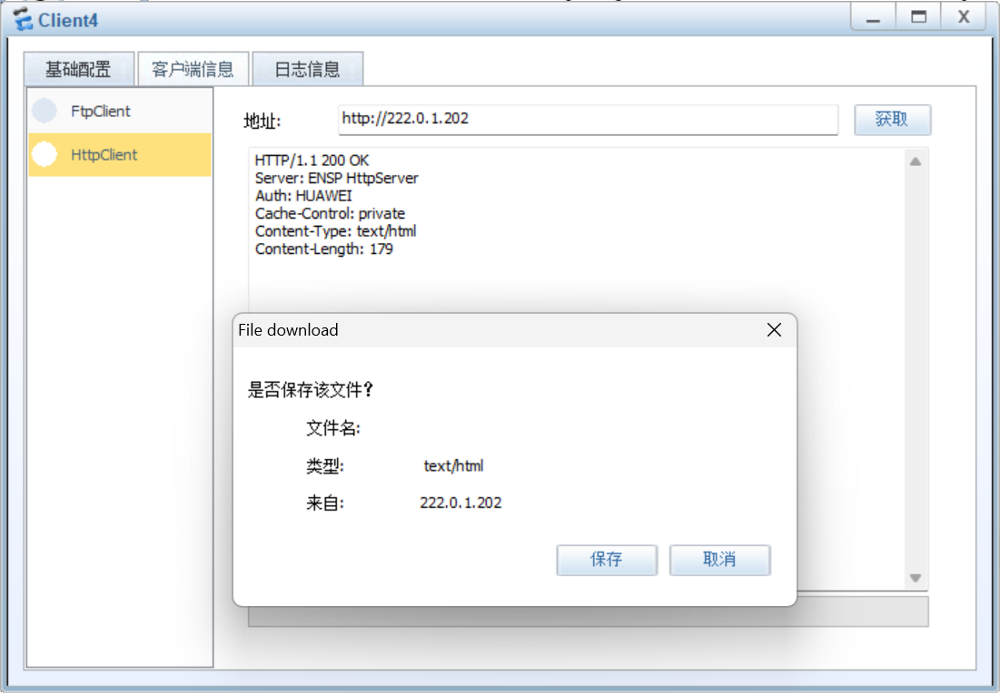
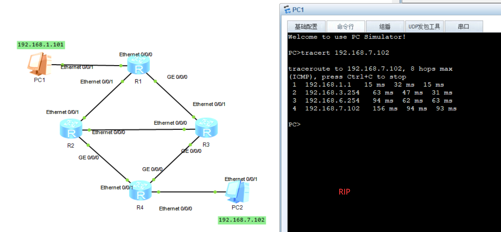
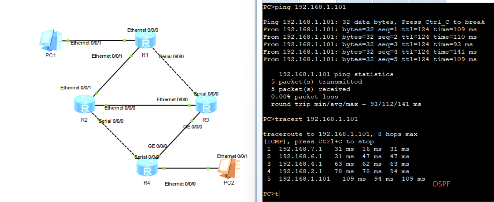

## 12110817 张展玮

## Practice 12.1

#### Client 4 accesses the http server Server2

#### Client 4 accessed the http server Server1

## Practice 12.2(1)

### Practice 12.2(2)

RIP和OSPF的不同：

- RIP使用距离矢量算法，OSPF使用链路状态算法
- RIP使用跳数作为度量值，OSPF使用成本作为度量值
- OSPF比RIP收敛得更快
