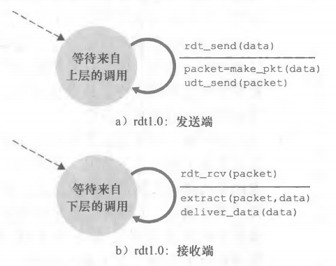
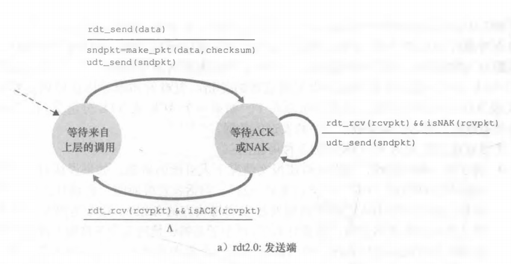
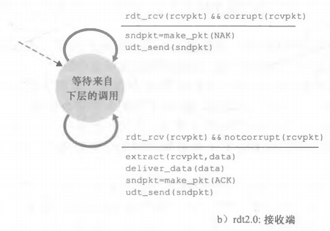
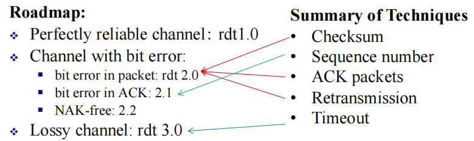
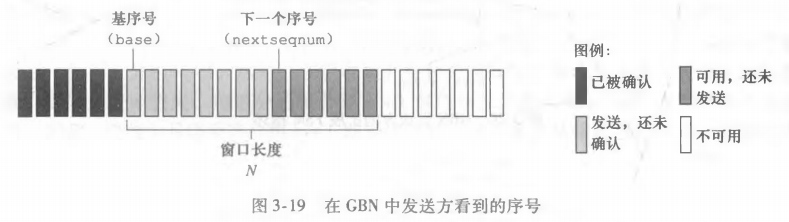

[toc]


## 2. Multiplexing and Demultiplexing

### 2.1 Multiplexing (多路复用)

The job of gathering data chunks at the source host from different sockets, encapsulating each data chunk with header information (that will later be used in demultiplexing) to create segments, and passing the segments to the network layer.

### 2.2 Demultiplexing (多路分解)

This job of delivering the data in a transport-layer segment to the correct socket.

multiplexing.png)

### 2.3 UDP的多路复用与多路分解

UDP socket is **fully identified** by a two-tuple consisting of:

- a destination IP address
- and a destination port number.

如果两个UDP报文段有**不同的源IP地址和/或源端口号**，但具有**相同的目的IP地址和目的端口号**，那么这两个报文段将通过**相同的目的套接字**被定向到相同的目的进程。


### 2.4 TCP的多路复用与多路分解

TCP socket indentified by 4-tuple:

- source IP address
- source prot number
- dest IP address
- dest port number

两个具有**不同源IP地址或源端口号**的到达TCP报文段将被**定向到两个不同的套接字**。


## 3 UDP: conectionless transport

### 3.1 conectionless

- **No handshaking** between UDP sender, receiver
- Each UDP segment handled independently of others
- No congestion control

### 3.2 advantage and disadvantage

advantage:

- Immediately pass (no cangestion control)
- no connection-establish delay
- No connection state: server can support more clients
- Smaller packet overhead

disadvantage:

- congestion(网络拥塞加剧)
- overflow(网络带宽不足导致丢包，接收方处理能力不足导致丢包)
- fairness(由于UDP不参与拥塞控制，它可能会占用比基于TCP的应用更多的网络带宽)
- not reliable(无序，不安全)

### 3.3 used in

- streaming multimedia apps
- DNS

### 3.4 segment header

``` 
<----------32bits(4bytes)--------->
-----------------------------------
|  source port # |   dest port #  |
-----------------------------------
|     length     |    checksum    |
-----------------------------------
|                                 |
|           application           |
|              data               |
|            (payload)            |
|                                 |
-----------------------------------

length: in bytes of UDP segment (data + header)
```

#### 3.4.1 checksum

sender

- 依次累加
- 如果最高位溢出，则回卷（wrap around，把溢出位加到最低位）
- 最后取反码

receiver

- 将所有的words累加（包括checksum），正确结果是全1


## 4 principles of reliable data transfer

可靠数据传输原理

### 4.1 FSM

- 横线上方：引起状态转移的事件
- 横线下方：状态转移时采取的动作
- $\Lambda$：缺少动作或事件
- 虚线：初始状态

### 4.2 rdt1.0

经完全可靠信道的可靠数据传输



### 4.3 rdt2.0

经具有比特差错信道的可靠数据传输

#### 4.3.1 ARQ(自动重传请求) protocol:

- error detection
- receiver feedback
  - ACK
  - NAK
- retransmission

#### 4.3.2 FSM





#### 4.3.3 stop-and-wait(停等)

当发送方处于等待ACK或NAK的状态时，它不能从上层获得更多的数据。

#### 4.3.4 ACK & NAK error

重传当前数据分组。

但会引入冗余分组（duplicate packet）。

冗余分组的根本困难在于接收方不知道它上次所发送的ACK或NAK是否被发送方正确地收到。因此它无法事先知道接收到的分组是新的还是一次重传。

解决：使用 **序号**(rdt2.1) + **duplicate ACK**(rdt2.2)

### 4.4 rdt3.0

经具有比特差错的丢包信道的可靠数据传输

使用倒计时定时器。

### 4.5 rdt summary



### 4.6 pipelining

#### 4.6.1 why

$$
\text{utilization } U_{sender} = \frac{\text L/\text R}{\text{RTT} +\text L/\text R} = \frac{0.008}{30 + 0.008} \approx 0.00027
$$

#### 4.6.2 what we need

- range of sequence numbers must be increased
- buffering at sender and/or receiver
- Go-Back-N, Selective Repeat

#### 4.6.3 Go-Back-N




