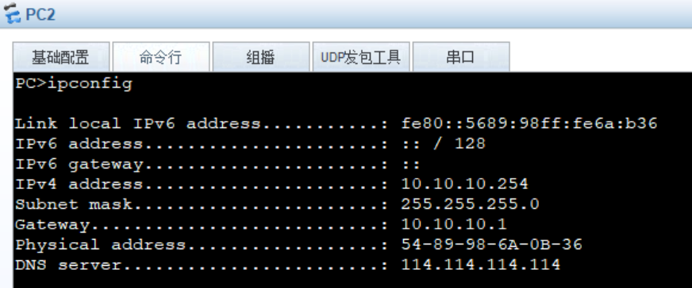

### VLAN-D




### VLAN-M


### VLAN-N


### VLAN-D to VLAN-M


```


AR11
[V200R003C00]
#
 snmp-agent local-engineid 800007DB03000000000000
 snmp-agent 
#
 clock timezone China-Standard-Time minus 08:00:00
#
portal local-server load flash:/portalpage.zip
#
 drop illegal-mac alarm
#
 wlan ac-global carrier id other ac id 0
#
 set cpu-usage threshold 80 restore 75
#
acl number 2000  
 rule 5 permit source 10.10.0.0 0.0.255.255 
#
acl number 3000  
 rule 6 deny ip destination 222.0.1.102 0 
 rule 7 deny ip destination 222.0.1.104 0 
 rule 8 deny ip destination 10.10.40.2 0 
 rule 9 deny ip destination 10.10.40.4 0 
#
aaa 
 authentication-scheme default
 authorization-scheme default
 accounting-scheme default
 domain default 
 domain default_admin 
 local-user admin password cipher %$%$K8m.Nt84DZ}e#<0`8bmE3Uw}%$%$
 local-user admin service-type http
#
firewall zone Local
 priority 15
#
 nat address-group 2 222.0.1.101 222.0.1.101
#
interface Ethernet0/0/0
#
interface Ethernet0/0/1
#
interface Ethernet0/0/2
#
interface Ethernet0/0/3
#
interface Ethernet0/0/4
#
interface Ethernet0/0/5
#
interface Ethernet0/0/6
#
interface Ethernet0/0/7
#
interface GigabitEthernet0/0/0
 ip address 192.168.4.254 255.255.255.0 
#
interface GigabitEthernet0/0/1
 ip address 222.0.1.1 255.255.255.0 
 traffic-filter inbound acl 3000
 nat static global 222.0.1.102 inside 10.10.40.2 netmask 255.255.255.255
 nat static global 222.0.1.103 inside 10.10.40.3 netmask 255.255.255.255
 nat static global 222.0.1.104 inside 10.10.40.4 netmask 255.255.255.255
 nat outbound 2000 address-group 2 
#
interface NULL0
#
ospf 1 
 import-route rip 1
 area 0.0.0.0 
  network 192.168.4.0 0.0.0.255 
#
rip 1
 version 2
 network 222.0.1.0
 import-route ospf 1
#
user-interface con 0
 authentication-mode password
user-interface vty 0 4
user-interface vty 16 20
#
wlan ac
#
return
```


## 静态NAT


## 动态NAT


## VLAN-G中任意一个PC，分别访问3个server


## VLAN-M中的任意一个PC，分别访问3个server


## 外网中的终端，分别访问3个server

