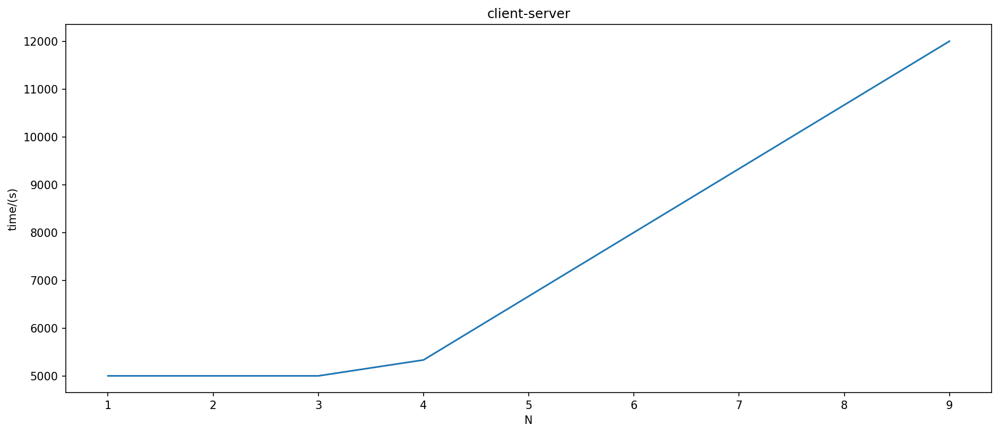
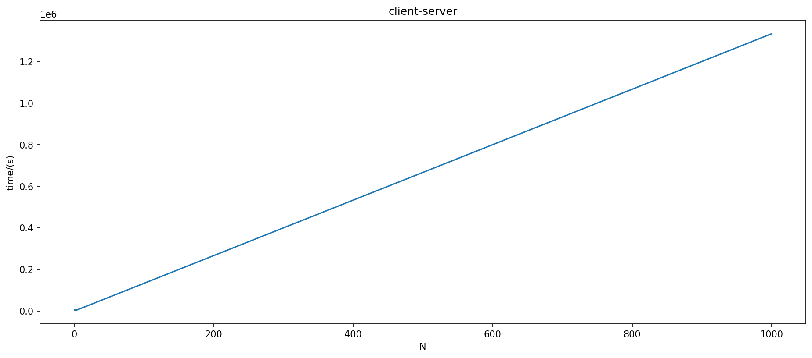
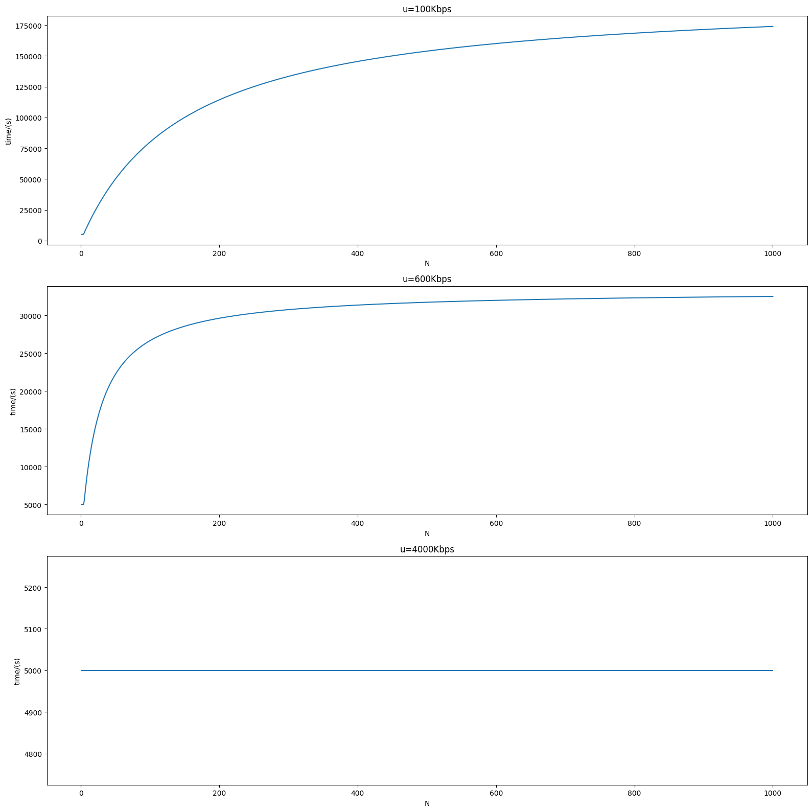

## Q1

- Application Layer
  - The application layer is where network applications and their application-layer protocols reside.
  - Protocols: HTTP, SMTP, FTP
- Transport Layer
  - The Internet’s transport layer transports application-layer messages between application endpoints.
  - Protocols: TCP, UDP
- Network Layer
  - The Internet’s network layer is responsible for moving network-layer packets known 
    as datagrams from one host to another.
  - Protocols: IP
- Link Layer
  - The Internet’s network layer routes a datagram through a series of routers between 
    the source and destination.
  - Protocols: Ethernet, WiFi, DOCSIS
- Physical Layer
  - The physical layer is to move the individual bits within the frame from one node to the next.
  - Protocols: one for twisted-pair copper wire, another for coaxial cable, another for fiber, and so on.

## Q2

- **TCP** is better suited for applications that require reliable, error-checked, and ordered delivery of data. TCP ensures that data sent from one end of a connection arrives intact and in the correct order at the other end. It is commonly used for applications where data integrity and accuracy are crucial.
  **Examples** of applications that are better suited for TCP include: Web Browsing, Email, File Transfer, Remote terminal access, Streaming multimedia.
- **UDP** is better suited for applications that prioritize speed and minimal overhead over reliability. UDP is a connectionless protocol, which means it does not guarantee the delivery of data or the order of delivery. While this may seem less reliable, it is advantageous for applications where speed and real-time communication are more critical than data integrity. 
  **Examples** of applications that are better suited for UDP include: Voice over IP, Online Gaming, Streaming Media, IoT, DNS

## Q3

#### (a)

$$
\text{end-to-end delay} = K\frac{L}{R} + Kd
$$

#### (b)

$$
\text{transmission rate allocated to each user} = \frac{R}{F} \text{ bit/s}
$$

$$
\text{end-to-end delay} = K\frac{L}{\frac{R}{F}} + Kd + \tau
$$

#### (c)

$$
\begin{align*}
\text{T} &= \overbrace{\frac{2 \times 1 \times 10^3}{2 \times 10^7}}^{\text{transmission delay}}s + 
\overbrace{1 \times 10^{-5}}^{\text{propagation delay}}s + 
\overbrace{5 \times 10^{-6}}^{\text{nodal delay}}s +
\overbrace{50\mu s}^{\text{time for p2 to be slower than p1}}\\
&= 175\mu s

\end{align*}
$$

## Q4

#### (a)

Traffic intensity $\frac{La}{R} = 1$.

Every packet will arrive at an empty queue and there will be no queuing delay.

#### (b)

Queuing delay of the **1-st** packet is $0$.

Queuing delay of the **2-nd** packet is $\frac{L}{R}$.

Queuing delay of the **3-rd** packet is $2\frac{L}{R}$.

...

Queuing delay of the **K-th** packet is $(K-1)\frac{L}{R}$.

Hence, the avg queuing delay is 
$$
\begin{align*}
\frac{\sum_{i=1}^{K-1} i\frac{L}{R}}{K-1} &= (K-1)\frac{L}{2R} \text{ (s)}
\end{align*}
$$

#### (c)

Both of them are **1**.  Hence, the nature of the arriving traffic impacts the queuing delay.

## Q5

#### (a)

Response message.

#### (b)

Persistent connection.

With HTTP 1.1 persistent connections, the server leaves the TCP connection open after sending a response. Subsequent requests and responses between the same client and server can be sent over the same connection.

#### (c)

There is no blank line before entity body.

#### (d)

The "Last-Modified" header allows the client (or proxy server) to determine whether the content has been modified since the last request. This information is crucial for caching mechanisms, as it helps in reducing unnecessary data transfer and improving network efficiency.

## Q6

#### (a)

$$
\Delta = \frac{1Mbits}{20Mbps} = 0.05s \\
\text{Average Access Delay} = \frac{\Delta}{1-\Delta\beta} = \frac{0.05}{1-10\times0.05} = 0.1s \\
\text{Average Response Time} = 2 + 0.1 = 2.1s
$$

#### (b)

$$
\text{Average Access Delay} = \frac{\Delta}{1-\Delta\beta} = \frac{0.05}{1-10\times0.05 \times (1-x)}
$$

$$
(1-x) \times \text{Average Access Delay} < 1
$$

It is solved that
$$
0.516 < x \leq 1
$$

## Q7

#### (a) 

$$
T_1 = RTT_0 + 13(2RTT_1 + \frac{L}{R})
$$

#### (b)

$$
T_2 = RTT_0 + 2RTT_1 + \frac{L}{R} + 3(2RTT_1 + \frac{L}{R})
$$

#### (c)

$$
T_3 = RTT_0 + 2RTT_1 + \frac{L}{R} + 12(RTT_1 + \frac{L}{R})
$$

## Q8

#### (a)

- HTTP is mainly a pull protocol—someone loads information on a Web server and users 
  use HTTP to pull the information from the server at their convenience.
  SMTP is primarily a push protocol—the sending mail server pushes the file to the receiving mail server.

- SMTP requires each message, including the body of each message, to be in 7-bit ASCII format.
   HTTP data does not impose this restriction.
- HTTP encapsulates each object in its own HTTP response message. 
  SMTP places all of the message’s objects into one message.

#### (b)

HTTP is not typically used as a mail access protocol for receiving emails. While it is technically possible to implement an email client that retrieves email messages from a mail server using HTTP, it is not a common practice. Email retrieval is usually done using protocols specifically designed for email access, such as POP3 (Post Office Protocol) and IMAP (Internet Message Access Protocol), which offer better support for managing and organizing email messages.

#### (c)

- Placing the receiver's mail server at the receiver's PC is not a common practice and is generally not recommended. If the receiver's PC is close, it cannot receive any email. Besides, it would lead to many issues such as reliability concerns and potential security vulnerabilities. 
- Placing the sender's mail server at the sender's PC is also not common and not advisable. If placing the sender's mail server at the sender's PC, the sender cannot explore his/her emails in other devices.

## Q9

#### (a)

com

#### (b)

(example.com, dns.example.com, NS)

(dns.example.com, 200.200.200.17, A)

## Q10

#### (a)

$$
\frac{F}{d} = \frac{20 Gbits}{4Mbps} = 5000 \text{\;(s)} \\
\frac{NF}{u_s} = \frac{4}{3} \times 10^3 N \text{\;(s)} \\
D_{cs} = \max\{\frac{F}{d}, \frac{NF}{u_s}\}
$$

#### (b)

$$
D_{P2P} = \max\{ \frac{F}{u_s}, \frac{F}{d}, \frac{NF}{u_s+Nu}\} \\
\frac{F}{u_s} = \frac{4}{3} \times 10^3s \\
\frac{F}{d} = 5000s \\
$$

#### (c) 

Client-server distribution typically has a longer distribution time compared to P2P distribution, especially as the number of peers (N) increases. P2P distribution leverages the upload capacity of multiple peers, which can significantly reduce the distribution time.

Higher u values lead to shorter distribution times, as peers can upload data more quickly. When u becomes sufficiently large, time is determined by $\frac{F}{u_s}$ and $\frac{F}{d}$.

