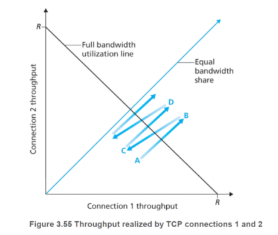
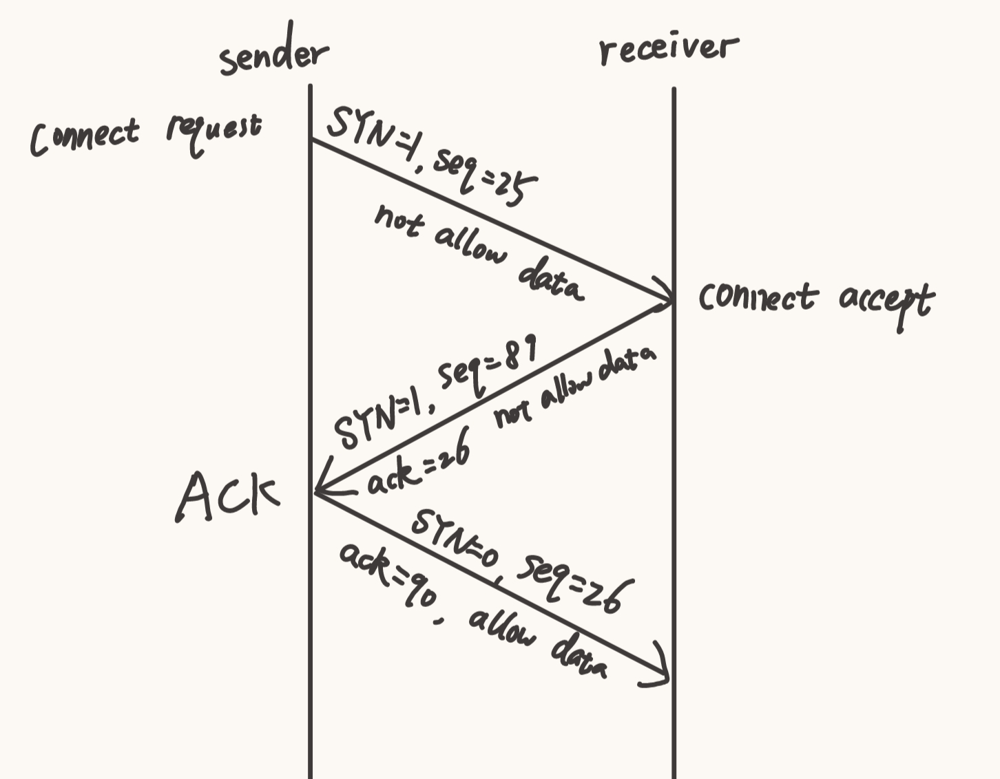

## Q1

#### (a)

```
  0110011001100000
+ 0101010101010101
------------------
  1011101110110101
->two's compliment
->0100010001001010
```

#### (b)

Sum up all words (contain checksum). If the result is all all 1, there is no error. 

#### (c)

No. If the error bits do not change the checksum, the receiver can not detect the error.

Example: 00000000000000010000000000000000

```
  0000000000000001  ->  0000000000000000
+ 0000000000000000  ->  0000000000000001
------------------      ----------------
  0000000000000001  ->  0000000000000001
```


## Q2

Go-Back-N:

- B1: send ack0
- B2: 0 1 2 3  <font color="blue">4 5 6</font>

SR:

- B1: send ack2
- B2: 0 1 2 3  <font color="blue">4 5 6</font>

## Q3

AIAD would not converge to an equal throughput. The throughput curve will oscillate repeatedly between points A and B.

This is because the additive increase causes the throughput to rise along a trajectory parallel to the 45-degree line. Conversely, the additive decrease causes the throughput to decline along a trajectory that is also parallel to the 45-degree line.  Such parallel movements do not lead towards the 'Equal bandwidth share' line.



## Q4




## Q5

Estimated RTT in short E, Sample RTT in short S.
$$
E = (1-\alpha)E + S
$$

#### (a)

$$
\begin{align}
E_4 &= (1-\alpha)E_3 + S_4
\\&= (1-\alpha)((1-\alpha)E_2 + S_3) + S_4 
\\&= (1-\alpha)^2 E_2 + (1-\alpha)S_3 + S_4
\\&= (1-\alpha)^2 ((1-\alpha)E_1 + S_2) + (1-\alpha)S_3 + S_4
\\&= (1-\alpha)^3 E_1 + (1-\alpha)^2 S_2 + (1-\alpha)S_3 + S_4
\\&= (1-\alpha)^4 E_0 + (1-\alpha)^3 S_1 + (1-\alpha)^2 S_2 + (1-\alpha)S_3 + S_4
\end{align}
$$

#### (b)

$$
\begin{align}
E_n &= (1-\alpha)E_{n-1} + S_n
\\&= (1-\alpha)((1-\alpha)E_{n-2} + S_{n-1}) + S_n 
\\&= (1-\alpha)^2 E_{n-2} + (1-\alpha)S_{n-1} + S_n
\\& \cdots\cdots
\\&= (1-\alpha)^n E_0 + \sum^n_{i=1} (1-\alpha)^{n-i}S_i

\end{align}
$$


